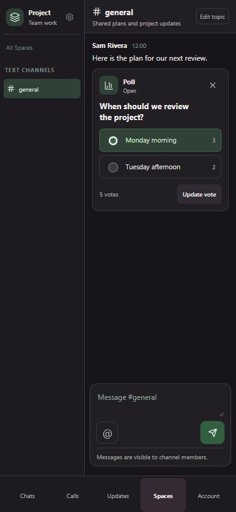
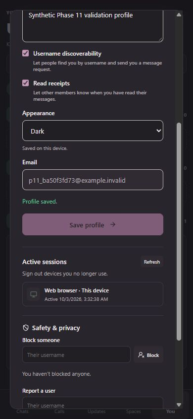
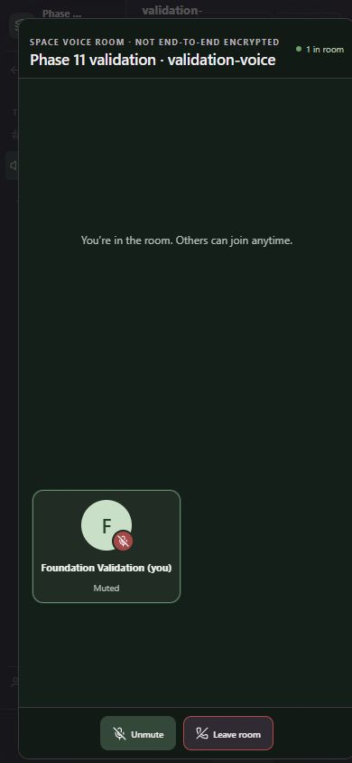
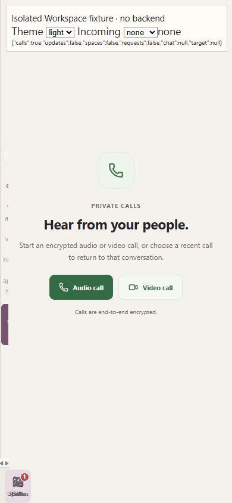

# Phase 11 — final foundation regression and UX validation

Validation date: 2026-10-03. Baseline: `9fad334d8d70160ab46b34e4d04549b61f151efd`.
Branch: `test/syncup-foundation-phase-11-final-validation`.

**FOUNDATION CLOSURE RECOMMENDED**, subject to the disclosed coverage limits below.
No unresolved BLOCKER or HIGH regression introduced by Phases 0–10 was identified.
This closes the bounded foundation refactor, not a production readiness/security certification.
Production behavior diff: **ZERO**. No correction, decomposition, palette work, feature addition, dependency change or migration is included.

## Starting gate and foundation history

Origin was fetched; local main was fast-forwarded and matched the required full SHA.
The working tree was clean before the validation branch was created. Each baseline command was run separately, before validation additions.

| Phase | Authoritative merged baseline |
| --- | --- |
| Pre-foundation product baseline | `7776b8878fb13800f9a259913eec7c8327c2ed6f` |
| 1 guardrails | `46dd7fe2dc875278481801502ec9a52d4d822737` |
| 2 characterization | `edab352301c52f62e8df558c20845ce2acaaf575` |
| 2.5 typecheck investigation | `05c0de1306357f15afbf2cd9c5066eecda3969f7` |
| 3 theme | `b9ef162c4e218706851f8db2d234161f1ae1b578` |
| 4 primitives | `ec8f6d15e2aabae80de9443730b6a554f967a456` |
| 5 API boundaries | `e7779cc21c501e1d0c33772f598561e35e3d14ca` |
| 6 Workspace | `3b4f7245b7f6efdbf7d39e7de890620abc316b5b` |
| 7 Conversation | `558e96a99896beb6cf1c3913f2d1072fcab1b05f` |
| 8 Spaces client | `82fb2330f8093854b91095faef9e0c56fd7b27b2` |
| 9 Spaces server | `9d23ed92d00209ff3d1a8a0cb3320119b02c3a97` |
| 10 types/CSS | `9fad334d8d70160ab46b34e4d04549b61f151efd` |

## Commands and evidence levels

| Lane | Command | Baseline | Final validation tree | Evidence level |
| --- | --- | --- | --- | --- |
| TypeScript | `npm run typecheck` | PASS, exit 0 | PASS, exit 0 | Client, Vite config and server compiler |
| Standard suite | `npm test` | PASS, 177/177 | PASS, 197/197 | Static, VM/component characterization and real WebCrypto; zero failures/skips |
| Architecture | `npm run check:architecture` | PASS, 267 edges | PASS, 267 edges | Production import/export graph and current rules |
| Build | `npm run build` | PASS, exit 0 | PASS, exit 0 | Client production build plus server compilation |
| Media V2 | `npm run test:media-v2` | PASS, 11/11 | PASS, 11/11 | Real crypto/framing/AAD; synthetic limits, not multi-GiB transfers |
| Integration | `npm run test:integration` | PASS, 1/1, no skip | PASS, 1/1 after natural-window retry; earlier HEAD repeat FAIL 429 disclosed | Actual HTTP API, PostgreSQL, storage and call/token contracts |
| Whitespace | `git diff --check` | Clean | PASS | Diff hygiene |
| Production freeze | `git diff <baseline> -- client/src server database package.json package-lock.json client/package.json` | Clean | Empty | Byte-level tracked production/config/dependency preservation |

Full command logs are in [phase-11-evidence](phase-11-evidence/); archived copies normalize trailing whitespace only. The Media V2 lane was explicitly run independently even though its safe suites also participate in current standard discovery.
Final HEAD commands are repeated after committing this same validation tree; the completion report records that confirmation.
No assertions, credentials, product configuration, npm scripts, heap flags or test discovery rules were weakened.

The first post-commit integration repeat failed its account-creation assertion with HTTP 429 (`rate_limited`, “Too many authentication attempts.”). Previous successful runs each make three sign-ups and one sign-in; rapid repeated validation exhausted the unchanged 10-attempt/15-minute authentication budget. An invalid-body auth probe returned `Retry-After: 49` and remaining zero. This is a real failed test run, not a skip or pass, and is archived in `phase11-head-integration-rate-limit.log`. The server was not restarted, its limiter was not reset, and no source/config/assertion was altered. After the advertised window expired, the unchanged command passed: 1/1, zero failures/skips, exit 0. Successful retry evidence is archived in `phase11-head-integration-retry.log`.

## Test inventory

All 177 existing tests remain unchanged. Twenty new cases:

- `final-auth-characterization.test.mjs`: 13; real Auth/Unlock callback bodies and AppRouter with explicit transport/key/hook doubles. Sign-up/sign-in payloads, legacy initialization, failure/busy behavior, unlock success/rejection, restored/expired/error sessions, cancellation and sign-out router transition.
- `final-calls-characterization.test.mjs`: 5; actual CallWindow effects and callApi with SDK/device/worker/HTTP doubles. Direct video intent, voice listen-only grant, unsupported group E2EE, connection-failure cleanup, terminal status and polling cleanup.
- `final-timing-characterization.test.mjs`: 1; actual sendTyping at 2499/2500 ms, repeated active/stop, offline and empty-chat guards with a controlled clock.
- `final-crypto-characterization.test.mjs`: 1; actual production vault/message/attachment/media-key functions using real Node WebCrypto and two synthetic identities. Roundtrips, wrong password/identity, missing envelope, tampered vault/ciphertext/nonce, media-key size and locked access.

The existing UI/runtime harnesses execute production bodies with mocked boundaries; they do not render a full authenticated application. The new crypto test does not substitute encryption or key functions. The CallWindow VM replaces only `import.meta.url` to make the unchanged body loadable in CommonJS; SDK, device and worker behavior are explicitly doubles.

## Functional regression matrix

Legend: **PASS** means that listed scope actually ran. **Partial** is deliberately bounded. **NE** means not executed. A lane omitted by a test is never inferred from another lane's pass.
“Integration” below is Node-driven real HTTP/DB/storage, not browser E2E. “Real E2E” is actual browser → current client → local API/infrastructure.

| Area | Static/unit | Integration | Browser/fixture | Real E2E | Result |
| --- | --- | --- | --- | --- | --- |
| Auth | PASS: Auth/Unlock/router/refresh/vault | PASS: signup/sign-in and account contracts | PASS: real forms, native required fields, Unlock/focus | Partial: signup, key unlock, session restoration/reload; browser sign-in/sign-out NE | PASS within scope |
| Account/profile | PASS: exact update/avatar/error/callback contracts | PASS: profile and real avatar storage/access | PASS: real AccountPanel busy/error | PASS: profile save/read after reload | PASS |
| Sessions | PASS: list/revoke and router restoration | Partial: authenticated cookies; listing/revoke not asserted by integration suite | PASS: seeded empty list | Partial: actual current session listed; revoke NE | Partial |
| Direct messaging | PASS: send/load/fallback/callback contracts | PASS: recipient-authorized encrypted request/chat delivery | PASS: seeded real Conversation children | NE | PASS contracts; browser E2E gap |
| Group messaging | PASS: initial/group intent and key boundaries | PASS: group creation/invites/departures, access and ordering | NE group-specific browser journey | NE | PASS contracts; browser gap |
| Message requests | PASS: Workspace request navigation | PASS: privacy, requests and acceptance | Partial: Requests control present; full request fixture NE | NE | Partial browser coverage |
| Replies | PASS: reply selection/clearing/decrypt fallback/send envelope | Partial: no dedicated HTTP reply roundtrip assertion | PASS: reply preview/cancel | NE | PASS characterization |
| Edits | PASS: encrypt/PATCH/draft/load order | PASS: edit authorization/window/control behavior | PASS: select/cancel edit | NE | PASS |
| Delete/hide | PASS: actual mutation callback forwarding | PASS: delete-for-me/everyone/access | Partial: named controls rendered; fixture callbacks are no-ops | NE | PASS contracts |
| Reactions | PASS: callback and SSE refresh contract | PASS: toggle and authorized responses | Partial: rendered controls/history counts | NE | PASS contracts |
| Pins | PASS: callback/event contracts | PASS: per-user/everyone pins; Space decisions | Partial: controls rendered | Partial: poll closure; message-decision browser mutation NE | PASS contracts |
| Read receipts | PASS: state-after-load read and SSE patches | PASS: cursor/receipt behavior | Partial: sent presentation, not live receipt propagation | NE | PASS contracts |
| Presence/typing | PASS: events, expiration, throttle, cleanup | PASS: authorized realtime/typing and denial | Partial: seeded presence only | NE peer-to-peer | PASS contracts |
| Drafts | PASS: restore/debounce/persistence/account behavior | NE: browser-local concern | Partial: composer text/edit presentation | NE reload/chat-switch durable draft journey | PASS characterization; real storage gap |
| Outbox | PASS: enqueue/wake/flush/denial-retention/account limitation | PASS: server idempotent replay; not actual browser outbox | NE offline-online browser flush | NE | PASS characterization; real offline gap |
| Encrypted attachments | PASS: real crypto/tamper and upload callback order | PASS: real encrypted storage/download/recipient decrypt | NE complete viewer journey | NE | PASS crypto/service; rendering gap |
| Media V2 | PASS: 11 focused cases plus hydration/runtime/job contracts | Partial: metadata/intent endpoints; not multi-GiB V2 transfer | NE complete V2 transfer/playback | NE | PASS bounded tests |
| Voice notes | PASS: source limits, preparation/send/retry/cancel boundaries | NE actual voice-note upload | PASS: real recording pause/resume/finish/discard; synthetic WAV play/pause and timeline | NE voice-note send/delivery | PASS local controls; delivery gap |
| Search | PASS: on-device and Spaces request/filter/navigation contracts | PASS: authorized people/chats/Spaces search and hidden results | PASS: loaded-message search | NE full authenticated search journey | PASS contracts |
| Calls | PASS: payloads, poll/cleanup, token/refresh and new CallWindow cases | PASS: direct lifecycle, authorization/token/history | PASS: CallsHome/direct banner/Answer | Partial: actual Calls home; direct media session NE | PASS contracts; media gap |
| Group Calls | PASS: key/provider/fail-closed/worker cleanup | PASS: ringing/key access/answer/decline/host end/member teardown | PASS: group incoming banner/Decline callback | NE multi-party group E2EE media | PASS contracts; E2EE media gap |
| Spaces | PASS: selection/categories/channel compositions/runtime | PASS: creation, category/channel types, invites/membership/settings | PASS: list/channel/settings/history/voice surfaces | Partial: create/select/text message/voice-channel creation | PASS |
| Spaces permissions | PASS: all roles, validation, missing-row SQL fallbacks | PASS: present permission rows/private grants/owner access | PASS: labelled real editor inspection | Partial: owner editor read; other roles/browser mutation NE | PASS; missing-row DB gap |
| Spaces files | PASS: metadata/size/MIME/name/access/state/header contracts | PASS: intent → content → complete → ready/list → download bytes/search | NE browser upload/download UI journey | NE | PASS service pipeline |
| Shared objects | PASS: poll/event/checklist/decision grammar, response, auth, temporal behavior | PASS: CRUD/vote/RSVP/assignment/completion/decision state | PASS: real seeded SharedObjectCard | Partial: poll create/vote/close | PASS |
| Spaces voice rooms | PASS: both exact entry payloads, canPublish and runtime boundaries | PASS: admission/grant/token/roster HTTP contracts | PASS: both join controls, callbacks | PASS bounded: one real participant joined/muted/left; remote delivery NE | Partial live scope |
| Updates | PASS: all object stacks, temporal projection and navigation contracts | PASS: object projection/filter/search reads | PASS: seeded presentation | PASS bounded: voted poll leaves Needs You; closed poll enters Decided; Open in channel | PASS |
| Theme | PASS: bootstrap/saved/system/listener/invalid parse | NE: local appearance concern | PASS: system/light/dark switch and reload | PASS bounded: Account dark persists through session reload; restored system afterward | PASS |
| Responsive navigation | PASS: desktop/mobile state transitions/cleanup | NE: presentation concern | PASS: exact 1440×900 and 390×844 surfaces | Partial: mobile Spaces/Updates/Account/Calls | KNOWN DEBT: mobile Calls targets overlap |

## Integration and infrastructure

The documented local environment was already running: API on port 4000, PostgreSQL 17 container on 54331 and LiveKit container on 7880. The API process runs the repository's `server/index.ts` through tsx. No services, databases or named volumes were reset; no credentials were read into the report or changed. This is the existing persistent development setup, not a newly provisioned disposable environment. The user explicitly requested this integration attempt. The existing suite creates synthetic accounts/data/storage objects and retains them according to its current behavior; no cleanup was added.

Baseline and final integration executions reached assertions: one passing scenario, zero skips, exit 0. Do not interpret its progress messages as proof of optional branches without checking HTTP evidence. The instrumented run records 275 requests and no 503 responses: Space file intent/upload/complete/download returned 201/204/204/200, voice token returned 200, and group creation/token/decline/end branches actually executed. The final integration run uses a validation-only Node preload to append sanitized method/path/status. It does not alter requests, responses or assertions, and records no headers, query values, bodies, cookies, tokens or keys. See [HTTP evidence](phase-11-evidence/phase11-integration-http.ndjson).

| Dependency | Mock/static evidence | Real execution | Unexecuted scope |
| --- | --- | --- | --- |
| PostgreSQL | Phase 2/9 real handler bodies with mocked rows; SQL guards | PASS: live API authorization, predicates, transactions, ordering, idempotency, durable reads and realtime | Missing permission rows deliberately deleted in DB; real refresh concurrency/lock ordering |
| Appwrite | Phase 9 SDK contracts, errors, upload/download/header ordering | PASS: configured production storage path through API; avatar, Space files, encrypted attachment upload/download | Full browser image/video/file viewer and large Media V2 transport |
| LiveKit | SDK/device/worker doubles, E2EE unsupported/failure characterization | PASS: actual single-participant Space room join, microphone mute, leave; separate signed token/lifecycle HTTP tests | Remote audio/video reception, multi-party E2EE frames, TURN/ICE deployment scenarios |
| Browser APIs/hardware | IndexedDB/OPFS/network/timers/workers largely doubled in characterization | PASS: actual Auth key crypto, theme storage/reload, MediaRecorder controls, synthetic audio decoding/play/pause, one voice-room microphone lifecycle | Real OPFS durability/quota, offline browser outbox, camera/remote peer media |

No remaining lane is labelled environment-blocked merely because it was not attempted. Recording acquisition initially remained pending, then completed; the final recording lane is a real local controls pass. No hardware simulator was used. The recording was discarded locally; neither its bytes nor audio were uploaded or committed. The silent WAV is explicitly synthetic playback evidence.

## Phase 2 preservation and permissions

All four `foundation-*` suites ran again unchanged as part of standard discovery; all pass. They preserve the following observations without endorsing or correcting them:

- Draft/outbox/upload-job stores remain keyed by chat/job/attachment, with no account scope. Sign-out retains storage/cache; a fresh mock consumer can read it. This does not prove another user can discover/decrypt another account's content in the actual UI.
- A denied outbox flush through the current transport retains ciphertext/envelopes/idempotency key, increments attempts, and schedules retry; sign-out failure does not lock keys or invoke success callbacks.
- Local plaintext/OPFS size-match hydration can precede metadata/key unwrap. Runtime starts once outside the authenticated workspace and stops only explicitly; mock lifecycle/listener cleanup remains unchanged.
- Ordinary requests share refresh; Calls refresh independently. Refresh network errors differ, and a reused server token revokes its family. Browser-cookie race and PostgreSQL concurrent rotation were not measured.
- Updates projects time without mutating stored channel objects; expired stored-open polls reject responses, while elapsed stored-scheduled events can still accept RSVP. Default hour, equality, 48-hour RSVP, cancellation, checklist deadline and decision stacks remain characterized.

| Role | Access/management protection | Missing-row view/send/speak behavior |
| --- | --- | --- |
| Owner | Current SQL bypass and owner channel/settings authority preserved | Owner/admin bypass preserved; membership prerequisites not removed |
| Admin | Current SQL bypass and permission-editor authority preserved | Same current bypass; not normalized with non-admin rows |
| Moderator | Current membership grants required; privileged decision/@everyone behavior preserved | `can_view=true`; text/object announcement fallback permits; files `can_send=true`; voice `can_speak=true` |
| Member | Current grants and resolved view/send/speak enforced | `can_view=true`; text/object ordinary channel send permits but announcement denies; files send permits; speak true |
| Guest | Explicit channel grants still required; hidden/private channel denial preserved | Same missing-permission fallback as member; fallback never creates membership |

These fallback values are SQL-source evidence plus mocked authorization characterization, **not a real missing-row PostgreSQL matrix**. Present-row allow/deny/private membership behavior ran through real HTTP/DB integration. File writes intentionally differ from text/object announcement fallbacks. Disabling View still disables Send/Speak; re-enabling View does not silently grant them.

## Theme and CSS ownership

System/light/dark lifecycle suites passed: startup, saved explicit preference, simulated OS changes in both directions, listener cleanup, storage-read fallback and invalid-value parsing. In the actual browser, each of system/light/dark was switched, reloaded, and confirmed using root DOM appearance/theme/colorScheme. Current OS preference was light. Actual OS switching was not performed; bidirectional changes are VM evidence.

Authenticated Account dark preference survived reload and key-unlock/session restoration. System was restored afterward. No post-bootstrap wrong-theme flash was observed in captured states. This is not a frame-by-frame first-paint/no-flash measurement; pre-JS fallback and bootstrap ordering remain protected by unchanged source and existing tests.

Phase 10's eight ownership protections pass unchanged:

| Inventory | Frozen result |
| --- | --- |
| Expanded platform stylesheet | SHA-256 `5b3f9a226487b5045f85076c98b4e284af92d79eb453437888e1368855cd0e44` |
| Rule nodes | 1,157 |
| Declarations | 4,507 |
| Moved Spaces region | SHA-256 `4028bcbccd9e7493ad4c3fdf12e1bc116735086a177e8e3968aa65d592c64ee9` |
| Tokens | SHA-256 `ebdf159beeb12fbf09e13130180dabc0dcc96fc833986fe1e3c9b537468fa26d` |
| Primitives | SHA-256 `c8537a42c94ff98ec2c421d457b729eae191fe37ab8a8e5652243ac7a67b84e1` |

The stylesheet stream, cascade, selectors, specificity, duplicate rules, nesting, keyframes, token-first import order and all selected type declarations/importer emitted-JS hashes stay frozen. No production CSS edit occurred.

## Browser and visual evidence

The test-only Vite observer installs before fixture/app modules and writes console.error/warn, resource errors, uncaught exceptions and unhandled rejections into a hidden DOM report. It does not change product callbacks or transport. Dev logs were also queried at every recorded checkpoint. All 24 ownership cases, 30 fixture checkpoints and 12 authenticated checkpoints have empty event/error/warning reports. Intentional seeded Account 400/error copy is a controlled fixture response, not a console failure. No disabled-network rejection was triggered by the executed fixture controls.

| Browser matrix | Executed surfaces | Scope |
| --- | --- | --- |
| 1440×900 fixture | Auth sign-up/sign-in/Unlock, Workspace/inbox, Conversation, Calls/direct/group banners, Account/profile, Report dialog; Spaces list/channel/settings/Updates in three modes | Actual components/hooks where documented by each original fixture, seeded presentation/transport elsewhere |
| 390×844 fixture | Auth/sign-in/Unlock/focus, chats/Conversation/search/reply/edit/back, navigation/Calls, Account/error/Report, Spaces/history/voice, Updates and settings | Same explicit fixture boundaries |
| Additional media fixture | Silent WAV play/pause/timeline/send callback; real MediaRecorder pause/resume/finish/discard | Local media controls; no voice upload |
| Authenticated desktop capture | Workspace, Space creation/message, poll/Updates/source navigation and permission editor | Initial actual application raster 1280×720; not incorrectly labelled 1440×900 |
| Authenticated mobile | Spaces, Updates, Account dark, reload/unlock, real voice room mute/leave | 390×844 captures; final Calls capture raster 328×709 after browser scaling changed |

Required exact-size coverage is the verified fixture matrix. Supplemental authenticated/recording captures were checked for actual raster dimensions and corrected; later browser host scaling changed. Raster dimensions are attached to each checkpoint. These are not all the same thing as an authenticated journey at an exact CSS viewport. No synthetic fixture is labelled authenticated E2E.

Frozen Phase 10 comparison was rerun against existing screenshots and full body-element computed-style/bounds inventories. The validation observer's hidden output is excluded from the DOM inventory; no visible fixture markup changed.

- 16/16 explicit light/dark cases retain **every computed property and element rectangle** across both required sizes.
- 8/8 explicit mobile light/dark JPEGs are byte-identical to Phase 10.
- The eight explicit desktop JPEGs are not byte-identical despite exact DOM/style/bounds equality. JPEG quantization tables match; the raster difference is an unresolved screenshot/rendering-environment discrepancy, not claimed as an encoding-only difference or proven product regression.
- Eight System cases resolve to current light OS rather than Phase 10's dark OS; their appearance difference is expected environment behavior. The frozen baseline was neither replaced nor re-labelled as a new baseline.
- Newly added media/authenticated screenshots are observational evidence only; no manufactured visual baseline is claimed.

See [ownership comparison](phase-11-evidence/ownership-comparison.json), [fixture checkpoints](phase-11-evidence/browser-journeys.json), and [authenticated checkpoints](phase-11-evidence/authenticated-journeys.json). All screenshots remain locally under the thread's Phase 11 visualization directory; four representative images are committed below.





## Known mobile Calls defect

Classification: **KNOWN DEBT**, pre-existing; functional impact **MEDIUM**.
At the exact 390×844 Workspace fixture, `.workspace` computes three columns `0px 0px 390px`; `.inbox-pane` is 1px wide and the later Calls rule occupies column 3. Bottom navigation is only 16px wide. Five button rectangles overlap at `[8,788,44,56]`; center-point hit testing reaches Chats but not the other four intended button targets. Audio call still activates; keyboard activation can leave Calls. The actual authenticated mobile Calls screen reproduces the approximately 16px navigation symptom too.

The later `.calls-home { display:grid; grid-column:3 }` overrides the earlier mobile `display:none`. Both conflicting rules already exist in pre-foundation `7776b8878fb13800f9a259913eec7c8327c2ed6f`; Phase 6 separately rendered its old baseline and documented the same symptom and pointer problem. This is baseline-backed known debt, not a new Phase 6/10 extraction regression. No fix is included.



## Accessibility, contrast, performance and realtime smoke

Accessibility is a representative smoke check, not a WCAG audit. Real Auth required-field submission focuses the first invalid field. Auth/Unlock/Profile forms expose labels; actions have accessible names; Profile/Report have labelled dialog roles; IncomingCallBanner has alertdialog semantics. Unlock action keyboard focus has a visible 2px outline. Profile close works with Enter. Escape leaves Profile open, matching existing tests; modal focus trapping/restoration was not added by Phase 4 and remains known accessibility debt. No new obvious keyboard trap was found in the executed controls. Mobile Calls pointer overlap is the known exception. A complete focus traversal/screen reader/contrast-ratio audit was not performed.

Legacy green controls and feature-specific palette/contrast concerns remain known debt, especially Calls/voice/media/advanced Spaces. No palette correction or measured contrast compliance is claimed.

Build retains existing large-chunk and ineffective dynamic jobStore-import warnings. LiveKit client chunk is 519.38 kB (134.99 kB gzip); main is 457.48 kB (131.05 kB gzip), emoji picker 333.05 kB (82.52 kB gzip), CSS 141.24 kB (23.96 kB gzip). They match baseline build sizes/warnings; no bundle optimization was performed. A temporary test-config extension warning was corrected by naming `.ts`; it affected only the validation harness.

No obvious console spam or runaway visual activity was observed. Browser request counts/timer leak profiling were not instrumented, so zero duplicate real subscriptions/requests is not asserted. Existing Workspace/Conversation/Spaces harnesses execute lifecycle setup/cleanup and assert identical listener removal, EventSource closure, cancelled results and timer clearing. Real integration executes authorized SSE sequence hints and typing, rather than mocking PostgreSQL notifications. Actual browser navigation and reload worked; long-lived reconnect/offline/online endurance was not executed.

## Timer/event parity and architecture

All previously characterized timer/event tests pass:

| Owner | Frozen timing/threshold |
| --- | --- |
| Workspace | Incoming Calls 3000 ms; refresh/outbox 15000 ms; initial deferred load 0 ms |
| Conversation | Highlight 1600 ms; remote typing 3500 ms; draft 250 ms; fallback 30000 ms; typing throttle 2500 ms; older `<120`; bottom stick `<80` |
| Spaces | Metadata refresh 15000 ms; channel fallback 5000 ms; highlight 4000 ms |
| CallWindow additional characterization | Status 4000 ms; voice roster 5000 ms |

Custom `syncup-close-chat`, `syncup-refresh-chat`, `syncup-outbox-wake` remain unchanged. Conversation SSE: `message.created`, `message.updated`, `message.pinned`, `message.reactions`, `message.delivered`, `chat.read`, `presence`, `typing`, `membership.changed`. Spaces channel/mention/object/membership events and their exact listener registrations are protected by the existing Spaces runtime suite. No timer value/event name was edited.

Architecture remains 267 resolved internal edges, zero forbidden edges, zero shared→feature imports, zero cross-feature private feature-API imports. Twenty-one existing informational cross-feature dependencies remain; Workspace composition is excluded only from the debt listing. The current guard does **not** perform a general cycle audit; no new policy or global cycle-free claim is introduced. Production graph is byte-unchanged.

Phase 9 suites pass again: authorization variants; exact SQL predicates/parameters; transaction commit/rollback/release ordering; message/mention/object realtime publications; Appwrite/LiveKit contracts; validation errors and temporal behavior. HTTP integration adds real DB/storage evidence but does not replace missing-row or deterministic-clock characterization. Representative method/path/params/query/body/status/response/error contracts remain covered at their existing exact boundaries. No endpoint, response shape, schema, payload or error was changed.

## Findings classification and closure limits

| Finding | Classification | Origin | Reproduction/impact | Closure decision |
| --- | --- | --- | --- | --- |
| Calls implicit mobile grid and overlapping pointer targets | KNOWN DEBT (MEDIUM impact) | Pre-existing, baseline-backed | Exact 390×844 fixture and supplemental authenticated Calls; 16px navigation | Dedicated responsive correction; does not represent foundation regression |
| Legacy green/palette/contrast | KNOWN DEBT | Pre-existing | Existing Calls/media/voice/Spaces feature colors, unmeasured contrast | Separate palette/accessibility scope |
| Calls home generic E2EE copy versus direct-call transport encryption | KNOWN DEBT (MEDIUM communication impact) | Pre-existing baseline copy | CallsHome says Calls are end-to-end encrypted; actual direct CallWindow and README correctly distinguish 1:1 transport encryption from group E2EE | Separate copy correction; no cryptographic behavior changed |
| Browser persistence/account ownership and plaintext hydration | KNOWN DEBT | Pre-existing Phase 2 contracts | Mock account switch/store/cache tests; UI discovery/security impact not established | Separate security/persistence review |
| Independent Calls refresh and refresh-family reuse | KNOWN DEBT | Pre-existing Phase 2 contracts | Two refresh paths and reuse-family handler; browser/DB race not measured | Separate auth concurrency scope |
| Spaces fallback differences | KNOWN DEBT | Pre-existing | Missing-row text/object announcement deny differs from file write allow | Separate permission/data-integrity decision |
| Stored/projected poll/event discrepancies | KNOWN DEBT | Pre-existing | Updates projection differs from stored channel state; elapsed RSVP behavior preserved | Separate temporal domain decision |
| Escape/focus trap/restoration absent in legacy dialogs | LOW / KNOWN DEBT | Pre-existing Phase 4 characterization | Escape does not close Profile; explicit close button keyboard activation works | Separate accessibility correction |
| New account immediately shows Unlock | LOW | Pre-existing, baseline-backed | Actual signup → Unlock → Workspace; AppRouter unchanged from pre-foundation baseline, initializes vault state before signup and only sets user on success | Additional password step; separate UX/state correction |
| Explicit desktop screenshot bytes differ with equal DOM/styles/bounds | TEST/HARNESS ONLY, LOW verification limitation | Uncertain rendering/environment cause | Eight desktop light/dark comparisons; same quantization tables, exact CSS and computed values | Disclose incomplete pixel proof; no product regression asserted |
| System snapshots differ from prior dark OS | TEST/HARNESS ONLY | Environment change | Current OS light, prior OS dark | Expected system behavior, retain frozen baseline |
| Recording acquisition initially pending | TEST/HARNESS ONLY | Environment/timing uncertain | Controls eventually started; pause/resume/finish/discard then passed | Resolved attempt, no persistent blocked lane |
| Browser viewport/raster scaling changed for supplemental captures | TEST/HARNESS ONLY | Environment | Artifact dimensions checked and names corrected; required fixture sizes verified separately | Report actual dimensions; no false exact-size E2E claim |
| Post-commit integration repeat hit authentication 429 | ENVIRONMENT-BLOCKED / TEST-HARNESS ONLY, resolved | Pre-existing limiter, triggered by repeated validation | Account creation expected 201 but received rate_limited 429; 10 attempts/15 minutes, Retry-After 49 seconds | Failure preserved; unchanged retry passed after natural expiry; not a product regression |
| Bundle warnings | KNOWN DEBT | Pre-existing | Same baseline chunk-size/jobStore dynamic-import warnings | Separate performance scope |

No unresolved new BLOCKER/HIGH regression was found. Unexecuted remote/multi-party E2EE, complete browser direct/group delivery, large Media V2 transfers, durable OPFS/offline outbox, missing-row DB matrix, real refresh races, camera and full accessibility/contrast remain explicit gaps, not passes or fabricated environment failures.

## Production diff proof and reproducibility

The baseline comparison includes `client/src`, `server`, `database`, all tracked package manifests/lockfiles and compiler/product config. Changed paths are confined to tests, test-only harness/fixtures, architecture documentation and validation artifacts. The production diff is empty. Existing tests and fixtures are not changed; only new validation files are added.

Run root fixtures:

```text
node node_modules/vite/bin/vite.js --config tests/helpers/final-preview.config.ts --host 127.0.0.1 --port 5174 --strictPort
```

Visit existing `tests/fixtures/{theme,workspace,conversation,spaces,ownership,ui-primitives}-preview.html` and the new `final-media-preview.html`. The ownership fixture accepts `scene=list|channel|settings|updates&theme=light|dark|system`. The other fixtures expose labelled screen/theme controls. For the actual application, use the same test config with positional root `client` on a separate port; requests proxy to the already running local API. Do not call fixture callbacks real delivery.

Optional sanitized integration evidence:

```text
NODE_OPTIONS=--import ./tests/helpers/integration-evidence.mjs
SYNCUP_INTEGRATION_EVIDENCE=<validation-output.ndjson>
npm run test:integration
```

These are test-process settings only, restored after the run. The logger preserves fetch arguments/response identity and does not read response bodies. The repository's documented prerequisites still apply; never infer integration PASS from a skipped health probe. No pre-existing service/tab was stopped; only the two agent-created preview servers and temporary browser tabs were cleaned up, and the temporary viewport override was reset.

Commit message: `test: complete SyncUp foundation final validation`.
Open the validation PR against main and **do not merge**. Stop after the final A–V report for human review.
