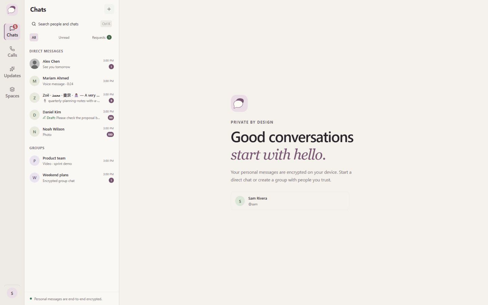
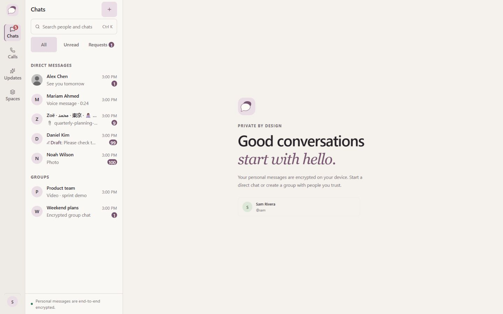
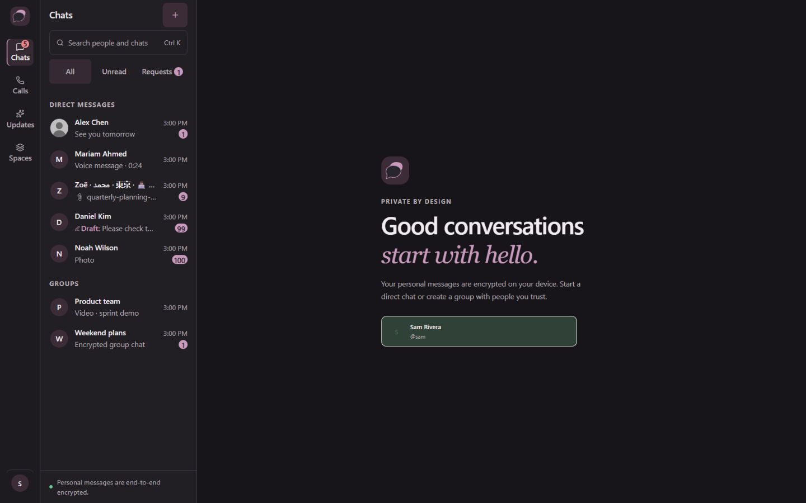
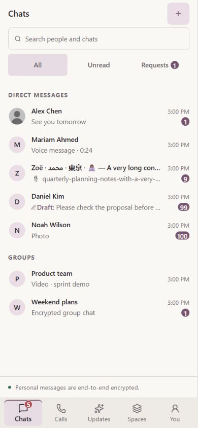

# Visual Phase 07 — Inbox / Chat List

## A. Git/base

Required base: `5e03916584781f7769243de88d4a9f785dbfe03f`. Branch: `design/syncup-inbox-chat-list-07`. The immutable baseline is archived from that Git commit, never reconstructed from the candidate. Final commit and PR identities are reported in the PR and completion response. This is an intentional presentation redesign; old Inbox pixel equality is not the target.

## B. Baseline

All six gates passed before production edits: typecheck, 253/253 tests (zero skips), architecture with zero violations, client/server build, Media V2 11/11, and real integration 1/1. Raw baseline logs are included in [evidence-07](evidence-07/). Existing build warnings concern chunk size and mixed static/dynamic imports of `jobStore.ts`.

## C. Ownership audit

The pre-edit selector/declaration inventory is [ownership-before.json](evidence-07/ownership-before.json).

| Classification | Actual contract |
| --- | --- |
| INBOX_SHELL | Shared heading, Chats list container, footer; root scroll containment |
| CHAT_ROW | Avatar context, name, preview, time and badge hierarchy |
| CHAT_ROW_STATE | Selected, hover, keyboard focus, real draft prefix |
| SEARCH | Native search trigger; opens the existing SearchDialog |
| ACTION | Chats new-conversation action and All/Unread/Requests filters |
| EMPTY_STATE | Existing Chats and caught-up branches; inline request empty text |
| LOADING_STATE | No Inbox loading/skeleton branch exists; none added |
| FEATURE_LOGIC | Filter predicates, ordering, date/preview/count logic, handlers and Calls grouping |
| SHARED_PRIMITIVE | Avatar image/fallback behavior and existing button/input contracts |
| LEGACY_COUPLING | Empty classes and section/error classes shared with Calls/RequestsPanel; global font inheritance; restricted Tailwind scale |

The audit covers default, dark and responsive selector branches, dimensions, radii, borders, badge declarations, typography, scrolling and state rules. Calls history and Calls empty content retain their declarations; only the common heading treatment changes. Inline request rows are list-owned. The separate RequestsPanel and workflow remain frozen.

## D. Behavioral contract

The two TSX files change only JSX classes. AST comparison retains imports, functions, callbacks, IDs, roles, ARIA, keys, text, conditions, child order, previews, timestamps and count values. There is no API, delivery, encryption, realtime, outbox, persistence, permissions, auth, voice, LiveKit, database or server implementation change. Desktop retains the selected chat when returning to Chats; mobile opening and return use the unchanged navigation hook. Existing current-chat transition characterization remains active.

Scroll geometry is a documented presentation compatibility correction: a long list previously expanded the workspace's implicit grid row beyond the viewport. The Chats-only `inbox-content` root and `inbox-chat-list` now explicitly have `min-height: 0`, allowing the existing `overflow-y: auto` container to scroll. The native PageDown capture verifies a 900px desktop Inbox, 683px list viewport, 1,834px content and roughly 597px list scroll. The baseline's oversized grid remains recorded. The resulting long-list shell/welcome bounds changes are separately enumerated, not concealed as Inbox-only changes. Calls is excluded from this constraint.

## E. ChatRow hierarchy

Continuous rows place a 32px Avatar beside the name/preview stack and a nonshrinking time/badge column. Names use `text-label`, previews `text-body-sm`, times `text-caption`, and unread counts `text-label`. Selected/hover metadata uses primary text because Light secondary-on-hover is only 4.34:1; default secondary-on-surface is 5.16:1.

## F. Density

Rows are approximately 56.25px (draft approximately 56.33px), versus the old 50px minimum. Semantic 8px vertical padding and 12px horizontal avatar gap accommodate readable two-line typography. There are no row cards, shadows, inter-row gaps or oversized avatars. Section separation uses existing spacing roles.

## G. Search

Inbox search is a button, not an input. It keeps its callback and `Ctrl K` hint, with a 44px target, semantic surface/border, aligned icon and readable body-sm label. The hint retains the existing mobile visibility boundary. Populated query, local message matching, API debounce, clear and Escape are exercised in the unchanged SearchDialog.

Compared with the actual global-search input, composer textarea, profile/auth forms and Updates input contracts, this trigger has no reusable input/value/change/clear contract. No shared Input is introduced. The existing IconButton has fixed 30px geometry; forcing adoption would conflict with the requested 44px new-chat target. The native action keeps exactly the original type, accessible name and callback.

## H. Selected/hover/focus

Selection combines semantic selected fill with a 2px plum leading edge. Hover uses the semantic hover surface without movement or motion. Native keyboard focus uses the existing focus token with an inset outline so scrolling does not clip it. Selected-plus-focused is captured independently. No new ARIA/selection semantics are invented.

## I. Unread

The predicate remains `Number(chat.unread_count) > 0`; the rendered count remains the original value. The list has no cap: 100 is still 100, unlike the existing navigation cap. Tests cover 0, 1, 9, 99, 100, a numeric string and missing counts. Compact plum badges preserve these values; request counts and New labels remain unchanged.

## J. Typography

The existing semantic roles drive title, names, previews, time, labels, section captions and footer. The global unlayered `button { font: inherit }` requires a scoped semantic label declaration for filter/empty-action text nodes. Zero margin/minimum geometry is explicit in the existing stylesheet where restricted Tailwind does not emit zero scale utilities. No arbitrary typography or new raw palette is used.

## K. Avatar

The shared Avatar file is untouched, including source, image key, alt, fallback initial, error handler and visibility policy. Inbox owns only 32px contextual geometry, label typography, surrounding spacing, and semantic brand-soft/primary fallback presentation. Image and fallback examples are captured; direct/group source policy is preserved.

## L. Empty/loading

Chats and caught-up copy/actions remain exact. The Chats empty state is compact and semantic. Calls' empty state and RequestsPanel's shared empty declarations remain unchanged through `:not()` exclusions of only migrated Inbox instances. No fake loading state, skeleton or new data branch exists.

## M. Mobile

390×844 captures include the list, focus, unread, populated search, empty, requests, scroll, offline/error, Calls boundaries and open-chat transition. Native keyboard traces cover opening and Back to chat list. Owned targets have 44px CSS minima; fractional browser bounds are recorded. Document/list overflow and metadata overlap assertions are applied before accepting candidate evidence. Existing bottom navigation is unchanged.

## N. Light/Dark/System

Warm Stone Light and aubergine-charcoal Dark use the existing semantic tokens. System is tested separately with OS Light and OS Dark emulated by the test bootstrap **before** CSS/module/theme initialization. Every accepted capture checks requested appearance, emulated OS probes, effective root theme, `color-scheme`, loaded fonts, errors, viewport and DPR. The appearance implementation and tokens are frozen.

## O. Responsive

The matrix includes 1440×900 and 390×844 plus widths 320, 699, 700, 701, 768, 1024, 1099, 1100 and 1101, in Light/Dark. Existing shell breakpoints and grid declarations are untouched. Long Unicode content and metadata positioning are checked at the narrow widths.

## P. Accessibility/contrast

Measured computed pairs are in [contrast-measured.json](evidence-07/contrast-measured.json). Sample minima: display name/selected foreground 11.70:1, preview and timestamp 5.16:1, search 5.16:1, unread 6.28:1, draft 6.06:1, and selected focus 3.06:1. All sampled text/focus pairs pass their 4.5:1/3:1 thresholds. This is not a whole-product WCAG claim. CSS ellipsis preserves full names and ordinary preview text in DOM/accessibility content. The existing runtime draft cutoff is preserved; see limitations.

## Q. CSS ownership

`platform.css`: **1,274 → 1,183 lines**. Inbox-applicable selector branches: **95 → 17**. Declaration sites: **234 → 34**. Counts include shared branches before migration; retained non-Inbox `:not()` branches are excluded after migration. Rule declarations are counted once even with multiple owned branches. [css-ownership.json](evidence-07/css-ownership.json) contains the method and inventory. No new Inbox stylesheet, tokens, package or configuration is added. Unrelated selector declarations, nesting and order are exact.

## R. Production diff

Exactly three production files relative to the required base:

- `client/src/features/workspace/components/InboxPane.tsx`
- `client/src/features/workspace/components/ChatRow.tsx`
- `client/src/shared/styles/platform.css`

All other client/server/package/config sources are frozen by a repository-wide test. Test-only API interception and fixture controls do not enter production. The fixture controls are hidden identically on both sides.

## S. Before/after evidence

Final totals and pixel diagnostics are in [summary.json](evidence-07/summary.json) and `comparisons.json.gz`. Raw browser captures and warmups are retained in a hash-verified compressed NDJSON archive; representative full screenshots remain directly viewable. Base/candidate use the same browser, viewport, DPR 1.190000057220459, fixture, bootstrap and capture procedure. Three stable warmup rasters precede three accepted same-build repeats. No masks or pixel tolerance are applied. JPEG dimensions are decoded directly (1440×900 and 390×844); DPR is separately recorded, and CSS-region mapping derives from actual raster/viewport dimensions.

[Fixture provenance](evidence-07/fixture-provenance.json) records two identical-on-both-sides fixture epochs. The correction adds the real `active-conversation` class to the selected conditional pane. All 12 affected selected/open cases and all native interaction traces were rerun. Inactive cases render no selected pane and remain from the original paired fixture; production hashes and the immutable baseline stay unchanged.

Visual review finds continuous compact rows, aligned Avatar/name columns, readable trailing metadata, full-DOM truncation, distinct selection/hover/focus, and unclipped 1/9/99/100 badges. Search uses one quiet border rather than a raised card. Mobile rows preserve these relationships without horizontal overflow. The Inbox uses no old green selection or stacked row cards; untouched adjacent content may retain its existing colors.

Archive verification/extraction: `node tests/helpers/inbox-archive.mjs [archive] [destination]`. Evidence manifest: `node tests/helpers/inbox-manifest.mjs`. Full decoded counts, percentages, bounding boxes and connected 32px regions are preserved per comparison, including every outside-region pixel.

**Review status: ready for ChatGPT review; PR remains draft.** The original strict zero-outside-pixels diagnostic remains false, but is superseded by the scoped ownership rule below. There are **122 paired cases**, **732 accepted screenshots**, **366 cross-build comparisons** (12 byte-identical), **732 same-build final comparisons** (all byte/pixel identical), and **64 matching native interaction step pairs**. DOM/attributes/IDs/ARIA/child order/values/focus and unowned computed styles/bounds have **zero unexpected differences**. Owned style/bounds changes are intentional; 112 long-list integration records are separately enumerated.

Cross-build changed pixels range from 0 to 265,334. Across 88 non-scroll cases (264 comparisons), **4–1,381 pixels outside the owned rectangles were initially unresolved**. Differences touch actual product UI and do not reproduce across final repeated captures of the same unchanged build. The focused follow-up below establishes the edge-raster classification for representative cases; repeat equality alone was not used as proof. Scroll cases have separate, expected layout integration changes and retain their raw outside counts.

| Light desktop example | Changed pixels | Percent | Full bounding box | Outside pixels | Outside bounding box |
| --- | ---: | ---: | --- | ---: | --- |
| Normal | 103,850 | 8.013117% | [64,0,352,897] | 65 | [64,832,68,849] |
| Hover | 123,097 | 9.498225% | [63,0,353,897] | 728 | [63,160,353,849] |
| Selected + focus | 130,460 | 10.066358% | [63,0,360,897] | 1,213 | [63,159,360,848] |
| Scroll integration | 248,417 | 19.167978% | [8,0,1056,900] | 79,377 | [8,160,1056,900] |

Boxes are raster-pixel `[left,top,right,bottom]` with exclusive right/bottom. The complete per-case report retains connected regions and percentage precision. The archive also keeps all settling frames: 23 of 511 warmup comparisons changed before stable capture; all accepted final repeats are exact. The focused follow-up below establishes the raster/JPEG boundary classification. Isolated/lossless screenshots remain unavailable; the precise split between antialias/resampling and JPEG quantization cannot be recovered from lossy originals.

### Focused follow-up — outside-region classification

No production code changed. Exactly five existing pairs were investigated: Light normal, hover, selected-plus-focus, Dark normal, and mobile Light normal. No full matrix rerun and no new accepted screenshots. [Focused coefficient/ownership report](evidence-07/focused-edge-investigation.json) and [diagnostic crops](evidence-07/focused-edge-crops.png) preserve the results. Twenty source hashes match the committed original capture archive.

| Case | Outside pixels | Maximum RGB channel delta | Outside box |
| --- | ---: | ---: | --- |
| Desktop Light normal | 65 | 2 | [64,832,68,849] |
| Desktop Light hover | 728 | 2 | [63,160,353,849] |
| Desktop Light selected + focus | 1,213 | 10 | [63,159,360,848] |
| Desktop Dark normal | 112 | 1 | [64,832,71,848] |
| Mobile Light normal | 0 | 0 | none |

Classification: **raster/JPEG boundary artifacts; no unintended CSS/layout spill found**. This is supported by independent checks, not a magnitude threshold:

- Every unowned node, including all computed properties, attributes/classes, bounds and focus, is exactly equal in these pairs. Existing same-build repetitions are byte-identical.
- The JPEG files use equal quantization tables and 4:2:0 subsampling (16×16 MCU). A baseline entropy decoder compares actual quantized DCT coefficients. Light normal/hover and Dark normal have no changed exterior luminance blocks; changes come from chroma blocks shared with the Inbox edge and their interpolation support.
- Selected-plus-focus additionally changes eight exterior luminance blocks at x=352..359. These sit immediately beside the fractional edge. The candidate row ends at x=351.142, its outline width/negative offset cancel outward reach, and its horizontally clipped list also ends at x=351.142. There is no row shadow or filter. Thus the owned focus paint cannot spill into those exterior blocks through CSS; their appearance is edge raster/resampling plus JPEG block reconstruction, not changed adjacent UI.
- Every reported outside pixel is within changed codec block/interpolation support. The decoder uses the actual JPEG sampling geometry, not an invented halo or pixel tolerance. Chroma neighbor interpolation follows the [libjpeg-turbo upsampling implementation](https://github.com/libjpeg-turbo/libjpeg-turbo/blob/main/src/jdsample.c). All raw differences and the original captures remain untouched.

**Scoped Phase 07 acceptance rule:** require exact unowned DOM/classes/IDs/ARIA/order/focus/computed styles/bounds; verify owned paint containment and stable same-build captures; preserve pixel counts/regions as diagnostics and investigate unexplained non-edge changes. The already documented long-list integration remains an explicit separate exception. The rule is pinned to the three captured production hashes and becomes invalid if any changes. It does not automatically approve raster differences in other phases or implementations. No masks, arbitrary tolerances, or visual hacks are used.

This follow-up is representative, not a new coefficient audit of all 122 cases. The existing full ownership checks remain evidence for the frozen implementation. Lossy originals cannot separate pre-encoding antialias/resampling from JPEG quantization exactly; that does not leave a CSS/layout spill mechanism unresolved in the inspected cases.

## T. Structural regression

280 ChatRow render comparisons cover direct/group, selected, read/unread, long Unicode/media preview, empty fallback, images and 60/61-character drafts. 32 Inbox combinations cover ordering, filters, Requests, empty, error/offline and Calls. Native button ID forwarding is tested independently. Historical phase guards accept only this exact recorded redesign, not general scope exceptions. Browser comparisons retain DOM, ARIA, IDs, order, values and focus; all computed properties and bounds outside owned presentation are compared, with long-list integration records separately retained.

## U. Gates

The final source candidate passes typecheck, **262/262 tests**, architecture **zero violations**, build, **11/11 Media V2**, and **1/1 real integration**, all with zero skips. Baseline and candidate command logs are retained as `baseline-*.log` and `precommit-*.log` in evidence-07. Nine focused tests were added. Architecture retains 276 resolved edges and 21 pre-existing informational cross-feature couplings. Build warnings match baseline.

Final gates are rerun on committed HEAD and reported with the commit identity in the PR/completion response. No subsequent amend is permitted without rerunning those gates.

## V. Limitations

The browser fixture uses real presentation, SearchDialog and navigation with synthetic data and an explicit test-only API boundary. It does not reproduce full Workspace crypto/realtime/outbox effects; source freezes, existing characterization and real integration cover those boundaries separately. Browser screenshots are JPEG; outside-region changes remain counted, with the focused classification and scoped acceptance rule recorded above. Isolated screenshot clipping was unavailable in this browser.

The existing draft preview truncates at 60 UTF-16 code units and can cut a grapheme; changing that algorithm would violate this phase's runtime freeze. Ordinary long names/previews retain full accessible DOM text. The pre-existing mobile Calls implicit-column coupling remains outside scope; Calls content and its geometry are compared against the baseline. Existing SearchDialog accessibility/focus contracts are preserved rather than redesigned. There is no whole-product accessibility claim.

## W. Recommended next surface

Conversation presentation is the next planned surface **after review and approval**. It is not started here. Do not merge this PR automatically.
